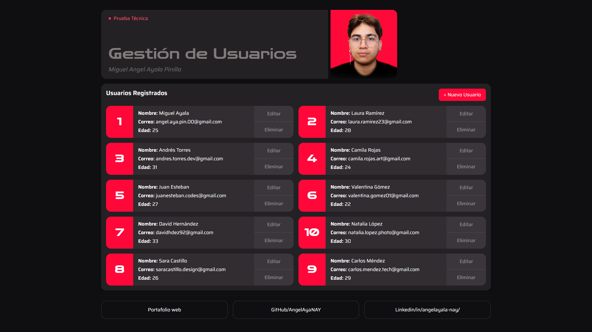

# 💼 Prueba Técnica – Desarrollador Fullstack (LER PREVENCIÓN LTDA)

Este repositorio contiene el desarrollo completo de la **Prueba Técnica para Desarrollador Full Stack** solicitada por **LER PREVENCIÓN LTDA**, con sede en Bogotá, Colombia.  
El objetivo del proyecto es crear un sistema **Gestión de Usuarios**, el cual implementa un CRUD completo (crear, leer, actualizar y eliminar) utilizando un **backend en Node.js + Express**, un **frontend en Angular + TailwindCSS**, y una **base de datos PostgreSQL**.

---

## PREVIEW DE LA APLICACIÓN

<p align="center">
  
</p>

---

## 🧠 Objetivo de la prueba

Evaluar las habilidades de desarrollo **Fullstack** mediante la creación de una aplicación funcional que cumpla con las siguientes características:

1. **Backend (Node.js + Express):**

   - Crear un microservicio que se conecte a una base de datos PostgreSQL.
   - Exponer una API RESTful con operaciones CRUD sobre la tabla `usuarios`.

2. **Frontend (Angular):**

   - Consumir la API desarrollada en el backend.
   - Mostrar y gestionar los datos de los usuarios mediante una interfaz interactiva.
   - Implementar un diseño atractivo y responsive utilizando TailwindCSS.

3. **Base de datos (PostgreSQL):**
   - Crear la tabla `usuarios` con campos `id`, `nombre`, `correo` y `edad`.
   - Insertar datos iniciales para pruebas.

---

## 🧩 Tecnologías utilizadas

| Componente                 | Tecnología              |
| :------------------------- | :---------------------- |
| **Backend**                | Node.js + Express       |
| **Frontend**               | Angular + TailwindCSS   |
| **Base de datos**          | PostgreSQL              |
| **Librerías**              | CORS, Dotenv, RxJS      |
| **Gestor de dependencias** | npm                     |
| **Pruebas y ejecución**    | Postman / Navegador web |

---

## 🗂️ Estructura general del proyecto

```
MiguelAyala_PruebaTecnica/
│
├── back_node/             # Backend con Node.js y Express
│   └── README-(BACK).md
│
├── front_angular/         # Frontend con Angular y TailwindCSS
│   └── README-(FRONT).md
│
├── database/              # Script SQL de PostgreSQL
│   ├── script_postgresql.sql
│   └── README-(DB).md
│
└── README-(MAIN).md       # Documentación principal del proyecto
```

---

## 🧭 Guía de ejecución (orden recomendado)

### 1️⃣ Paso 1 – Configurar la base de datos

1. Abre **pgAdmin 4** o **psql Shell**.
2. Crea una base de datos llamada `db_postgresql_angel`.
3. Copia y ejecuta el contenido del archivo:
   ```
   /database/script_postgresql.sql
   ```
4. Verifica la tabla `usuarios` ejecutando:
   ```sql
   SELECT * FROM usuarios;
   ```

---

### 2️⃣ Paso 2 – Ejecutar el backend

1. Accede a la carpeta del backend:
   ```bash
   cd back_node
   ```
2. Instala las dependencias:
   ```bash
   npm install
   ```
3. Crea un archivo `.env` con los datos de conexión a PostgreSQL:
   ```env
   DB_HOST=localhost
   DB_USER=postgres
   DB_PASSWORD=tu_contraseña
   DB_NAME=db_postgresql_angel
   DB_PORT=5432
   PORT=4000
   ```
4. Ejecuta el servidor:
   ```bash
   npm run dev
   ```
5. El backend estará disponible en:  
   👉 **http://localhost:3001/api/users**

---

### 3️⃣ Paso 3 – Ejecutar el frontend

1. Accede a la carpeta del frontend:
   ```bash
   cd front_angular
   ```
2. Instala las dependencias:
   ```bash
   npm install
   ```
3. Inicia el servidor de desarrollo:
   ```bash
   npm start
   ```
4. El proyecto se ejecutará en:  
   👉 **http://localhost:4200**

---

## 🧠 Descripción general del funcionamiento

El proyecto permite realizar operaciones CRUD sobre los usuarios registrados en la base de datos.  
El frontend (Angular) interactúa con el backend (Node.js) mediante peticiones HTTP y refleja los cambios en tiempo real.

- **GET:** Mostrar lista de usuarios.
- **POST:** Agregar nuevo usuario.
- **PUT:** Editar usuario existente.
- **DELETE:** Eliminar usuario.

---

## 🧾 Créditos

**Autor:** Miguel Ángel Ayala Pinilla  
**Ubicación:** Bogotá D.C., Colombia  
**Rol:** Desarrollador Fullstack Junior  
**Contacto:** [angel.aya.pin.00@gmail.com](mailto:angel.aya.pin.00@gmail.com)

---
